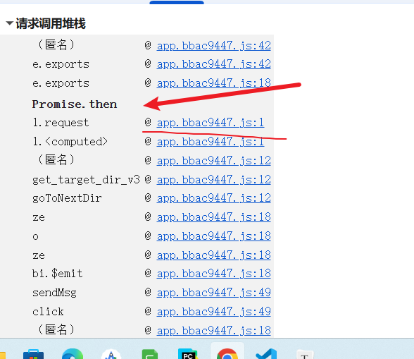

# EasyPaper 请求加密与响应数据解密逆向笔记

网站地址：[https://easy-paper.com/paperview](https://link.wtturl.cn/?target=https%3A%2F%2Feasy-paper.com%2Fpaperview&scene=im&aid=497858&lang=zh)

打开页面按 F12 调试的时候，页面会直接弹出 debugger 断点，一开始还以为很难处理，试着点单步跳过完全走不动。后面发现这只是最基础的反调试手段，直接右键这行断点代码，选择「一律不在此行暂停」就能彻底屏蔽，继续抓包分析。

抓完请求一眼就看出不对劲，接口地址长到离谱：`https://server.easypaper.com/paperdownload/dir_v3/xxxx`，末尾跟着一大串随机字符，每次刷新页面发起请求，这串加密字符串都会变。同时我还留意到接口返回的响应内容也是密文，整理下来本次逆向有两个核心目标：一是 URL 末尾动态加密串的生成逻辑，二是后端返回数据的解密算法。

## 一、URL 路径加密参数逆向

先全局搜相关关键字没找到明显线索，翻调用栈时发现页面用了 axios 请求拦截器，这也是接口参数统一加密的常见套路，截图记录了拦截器位置：



我点进`l.request`拦截函数打上断点，刷新页面断住后发现，传入的参数 e 已经拼接好了加密后的完整 URL。想要拿到原始未加密的请求信息，只能顺着调用栈往上回溯。

一路追踪找到发起目录请求的核心函数`get_target_dir_v3`：

```
get_target_dir_v3: function(e, r) {
    var t, i, n = 2 < arguments.length && void 0 !== arguments[2] ? arguments[2] : "", o = 3 < arguments.length && void 0 !== arguments[3] ? arguments[3] : 0;
    c.default.prototype.is_ban_country || (r.loading = !0,
    t = r.api.dir_v3_api,
    (i = {})[Object(a.randomString)(Math.floor(3 * Math.random() + 1))] = Object(a.randomString)(3),
    0 !== o && (i.back = o),
    "" !== n && (i.next = n),
    i.dir = e,
    c.default.prototype.is_demo ? i.source = "demo" : i.source = c.default.prototype.source,
    (i = Object(a.addTimeStamp)(i)) !== {} && (t += encodeURIComponent(l.a.encrypt(Object(a.randomString)(r.const.useless_string_len) + JSON.stringify(i), 1).replace(new RegExp("/","gm"), r.const.replace_target))),
    s.a.get(t).then(function(e) {
        var t = e.data;
        if ((t = Object(a.getDecryptServerData)(t)).status) {
            if (t.locked_resources === [])
                r.folders = t.folders;
            else {
                for (var i = [], n = 0; n < t.folders.length; n++)
                    -1 === t.locked_resources.indexOf(t.folders[n]) && i.push(t.folders[n]);
                r.folders = i
            }
            r.files = t.files,
            r.locked_resources = t.locked_resources,
            r.current_dir = Object(a.processCurrentDir)(t.current_dir)
        } else
            r.$message.error(r.$t("message.sorry_for_err"));
        r.loading = !1
    }).catch(function(e) {
        r.$message.error(r.$t("message.sorry_for_err")),
        r.loading = !1
    }))
}
```

这里变量`t = r.api.dir_v3_api`就是干净的原始接口地址，还没拼接加密串。往下翻一眼就定位到拼接加密字符的关键代码： `t += encodeURIComponent(l.a.encrypt(Object(a.randomString)(r.const.useless_string_len) + JSON.stringify(i), 1).replace(new RegExp("/","gm"), r.const.replace_target))`

顺着`l.a.encrypt`跟进，找到完整 AES 加密实现函数：

```
encrypt: function(e) {
    var t = 1 < arguments.length && void 0 !== arguments[1] ? arguments[1] : 0
      , i = o.a.enc.Utf8.parse(a[t].substring(0, 32))
      , n = o.a.enc.Utf8.parse(s[t].substring(0, 16));
    return o.a.enc.Utf8.parse(l[t].substring(0, 16)),
    o.a.enc.Utf8.parse(c[t].substring(0, 64)),
    o.a.enc.Utf8.parse(a[t].substring(0, 12)),
    o.a.enc.Utf8.parse(l[3]),
    o.a.enc.Utf8.parse(h[t] + u[1]),
    o.a.enc.Utf8.parse(a[t]),
    "object" == r(e) && (e = JSON.stringify(e)),
    o.a.AES.encrypt(e, i, {
        iv: n,
        mode: o.a.mode.CBC,
        padding: o.a.pad.Pkcs7
    }).toString()
}
```

加密明文组成也一目了然：随机字符串 + 完整请求参数 JSON，加密方式是 AES-CBC、Pkcs7 填充，把这套逻辑抠出来在本地复现就能生成和网页一模一样的加密串，整体逻辑不算复杂。

## 二、后端返回数据解密逆向

加密逻辑搞定后，再来处理响应密文解密，还是回到刚才的请求回调代码块：

```
s.a.get(t).then(function(e) {
    var t = e.data;
    if ((t = Object(a.getDecryptServerData)(t)).status) {
    if (t.locked_resources === [])
    r.folders = t.folders;
    else {
    for (var i = [], n = 0; n < t.folders.length; n++)
    -1 === t.locked_resources.indexOf(t.folders[n]) && i.push(t.folders[n]);
    r.folders = i
    }
    r.files = t.files,
    r.locked_resources = t.locked_resources,
    r.current_dir = Object(a.processCurrentDir)(t.current_dir)
    } else
    r.$message.error(r.$t("message.sorry_for_err"));
    r.loading = !1
})
```

`s.a.get(t)`发送请求，`e.data`就是服务器返回的原始密文，拿到密文后第一行就调用了解密方法：`t = Object(a.getDecryptServerData)(t)`，直接跟进这个函数，找到底层解密逻辑：

```
function b(e) {
    try {
    var t = r.a.decrypt(e);
    return e = JSON.parse(t.substring(10, t.length))
    } catch (e) {
    return {
    status: !1
    }
   }
}
```

流程很清晰：先用配套 AES 解密函数解开密文，再截取解密后字符串第 10 位之后的内容，转成 JSON 对象供页面渲染；解密失败就返回错误状态。

## 三、本地复现

把 AES 加解密、随机字符串拼接、URL 转义替换整套逻辑整理好，在本地 Python 完成复刻，调试截图路径： 


这套完整的逆向排查思路可以给大家做个参考。
---

## ⚠️ 免责声明

**本项目仅供学习交流使用，请勿用于非法用途。**

- 本案例用于技术研究和学习目的
- 请遵守目标网站的robots.txt协议和服务条款
- 请勿用于商业爬虫、数据售卖等违法行为
- 请勿对目标网站进行高频请求，避免影响正常服务
- 使用本项目代码产生的一切后果由使用者自行承担

**技术无罪，使用需谨慎。请合法合规使用爬虫技术。**
