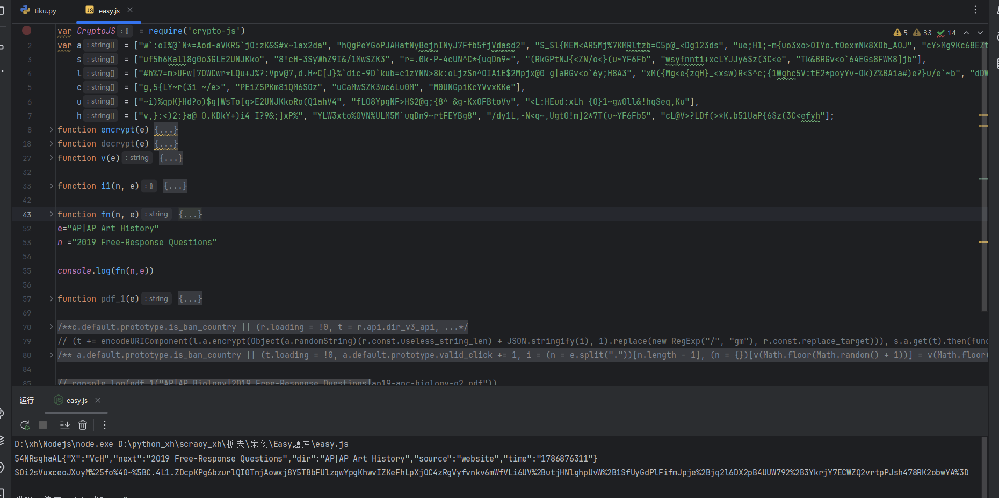

# EasyPaper题库 - URL加密 + 响应解密逆向

## 项目信息

- **网站**：https://easy-paper.com/paperview
- **难度**：⭐⭐⭐⭐⭐（高级）
- **技术**：AES-CBC加密 + axios拦截器 + 双向加解密
- **完成时间**：2024

---

## 技术亮点

### 🔥 完整的双向加解密

1. **URL路径加密**：随机字符串 + JSON参数 → AES-CBC加密
2. **响应数据解密**：AES-CBC解密 → 截取处理 → JSON解析
3. **axios拦截器统一处理**：所有请求都经过拦截器加密

### 🔥 反调试绕过

- 页面有debugger反调试
- 解决方案：右键 → "一律不在此行暂停"

---

## 逆向过程

### Step 1：绕过反调试

页面打开就弹debugger，使用技巧：
```
右键debugger代码 → 选择"一律不在此行暂停"
```

---

### Step 2：定位加密入口

**方法**：通过axios拦截器定位

1. 发现接口URL末尾有加密字符串
2. 全局搜索无果
3. 翻调用栈发现axios拦截器
4. 回溯到`get_target_dir_v3`函数

**核心代码**：
```javascript
t += encodeURIComponent(
    l.a.encrypt(
        Object(a.randomString)(r.const.useless_string_len) + 
        JSON.stringify(i), 
        1
    ).replace(new RegExp("/","gm"), r.const.replace_target)
)
```

---

### Step 3：拆解加密算法

**AES-CBC加密函数**：
```javascript
encrypt: function(e) {
    var t = 1 < arguments.length && void 0 !== arguments[1] ? arguments[1] : 0
    var i = o.a.enc.Utf8.parse(a[t].substring(0, 32))
    var n = o.a.enc.Utf8.parse(s[t].substring(0, 16));
    
    return o.a.AES.encrypt(e, i, {
        iv: n,
        mode: o.a.mode.CBC,
        padding: o.a.pad.Pkcs7
    }).toString()
}
```

**加密流程**：
```
随机字符串 + JSON参数 → AES-CBC加密 → URL编码 → 拼接到URL
```

---

### Step 4：响应数据解密

**解密函数**：
```javascript
function b(e) {
    try {
        var t = r.a.decrypt(e);
        return e = JSON.parse(t.substring(10, t.length))
    } catch (e) {
        return {
            status: !1
        }
    }
}
```

**解密流程**：
```
密文 → AES-CBC解密 → 截取第10位之后 → JSON.parse → 明文数据
```

---

## 核心参数

- **加密算法**：AES-CBC
- **密钥**：从数组`a[t]`中取前32位
- **IV**：从数组`s[t]`中取前16位
- **填充方式**：Pkcs7
- **后置处理**：URL编码 + 斜杠替换

---

## 本地实现



---

## 学到的经验

### 1. 反调试绕过技巧
- 基础反调试：右键"一律不在此行暂停"
- 进阶反调试：需要Hook或修改JS

### 2. axios拦截器是重点
- 很多网站用拦截器统一处理加密
- 直接搜参数名可能搜不到
- 要看调用栈找到拦截器位置

### 3. 双向加解密的完整链路
- 请求参数加密
- 响应数据解密
- 需要完整还原整个流程

### 4. 随机字符串的作用
- 防止密文相同（盐值）
- 增加逆向难度
- 解密时需要去掉

---

## 商业价值

这个案例展示了以下能力：

1. **反调试绕过**：基础必备技能
2. **拦截器逆向**：很多SPA应用都用这种方式
3. **双向加解密**：完整的数据保护方案
4. **复杂参数处理**：随机字符串 + JSON + 加密

市场价值：¥1500-2500/单

---

## 相关项目

- [烯牛数据双参数加密](../烯牛数据/)
- [七麦数据OB混淆](../七麦/)
- [一品威客双重加密](../一品威客/)

---

## ⚠️ 免责声明

**本项目仅供学习交流使用，请勿用于非法用途。**

- 本案例用于技术研究和学习目的
- 请遵守目标网站的robots.txt协议和服务条款
- 请勿用于商业爬虫、数据售卖等违法行为
- 请勿对目标网站进行高频请求，避免影响正常服务
- 使用本项目代码产生的一切后果由使用者自行承担

**技术无罪，使用需谨慎。请合法合规使用爬虫技术。**
