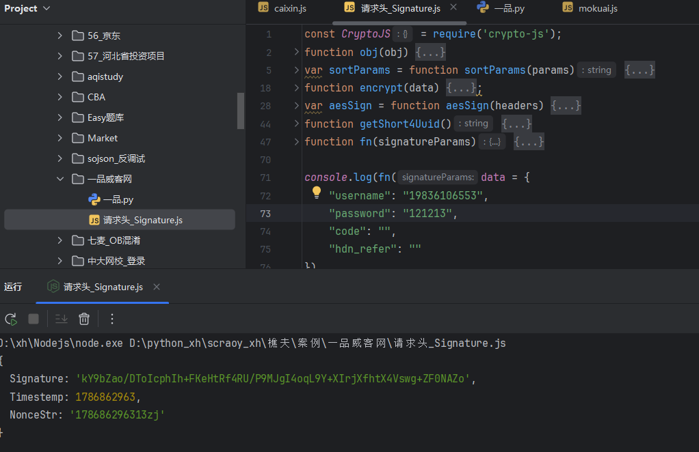

# 一品威客 - signature双重加密逆向

## 项目信息

- **网站**：https://www.epwk.com/login.html
- **难度**：⭐⭐⭐⭐（中高级）
- **技术**：MD5签名 + AES-CBC双重加密
- **完成时间**：2024

---

## 技术亮点

### 🔥 双重加密链路
```
原始数据 → MD5签名 → AES-CBC加密 → signature参数
```

这是典型的"签名+加密"双重保护机制，比单一加密更复杂。

---

## 逆向过程

### Step 1：参数定位

登录页面抓包，发现请求头中的`signature`参数每次都不同。

**定位方法**：
1. 全局搜索 `signature` 关键词
2. 找到可疑代码：
```javascript
j.Signature = Object(f.a)(j, L, h.i ? h.f : h.c);
```
3. 下断点跟栈，进入加密函数

---

### Step 2：加密链路分析

跟进加密函数，发现双重加密：

```javascript
h = function(t) {
    var data = arguments.length > 1 && void 0 !== arguments[1] ? arguments[1] : {}
    var e = arguments.length > 2 && void 0 !== arguments[2] ? arguments[2] : "a75846eb4ac490420ac63db46d2a03bf"
    var n = e + f(data) + f(t) + e;
    
    // 第一步：MD5
    n = d(n)
    
    // 第二步：AES
    n = v(n)
    
    return n
}
```

---

### Step 3：拆解加密算法

#### 第一层：MD5签名
```javascript
d = function(data) {
    return o.a.MD5(data).toString()
}
```

#### 第二层：AES-CBC加密
```javascript
v = function(data) {
    return o.a.AES.encrypt(data, l.key, {
        iv: l.iv,
        mode: o.a.mode.CBC,
        padding: o.a.pad.Pkcs7
    }).toString()
}
```

---

## 核心参数

- **签名密钥**：`a75846eb4ac490420ac63db46d2a03bf`
- **AES密钥**：在`l.key`中
- **AES模式**：CBC
- **填充方式**：Pkcs7

---

## 本地实现



---

## 学到的经验

1. **双重加密识别**：先MD5签名，再AES加密，这是常见的安全加固方案
2. **跟栈技巧**：从参数使用处反向追踪到加密入口
3. **参数搜索**：除了搜参数名，还可以搜API路径（如`user/login`）

---

## 商业价值

这个案例展示了处理**多层加密**的能力，市场上很多网站都采用这种"签名+加密"的方案，掌握后可以接类似的高价值项目（¥1000-2000/单）。

---

## 相关项目

- [财新网密码加密](../财新网/)
- [烯牛数据payload+sig双参数](../烯牛数据/)
- [七麦数据OB混淆](../七麦/)

---

## ⚠️ 免责声明

**本项目仅供学习交流使用，请勿用于非法用途。**

- 本案例用于技术研究和学习目的
- 请遵守目标网站的robots.txt协议和服务条款
- 请勿用于商业爬虫、数据售卖等违法行为
- 请勿对目标网站进行高频请求，避免影响正常服务
- 使用本项目代码产生的一切后果由使用者自行承担

**技术无罪，使用需谨慎。请合法合规使用爬虫技术。**
