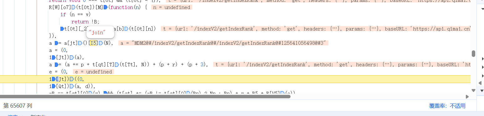
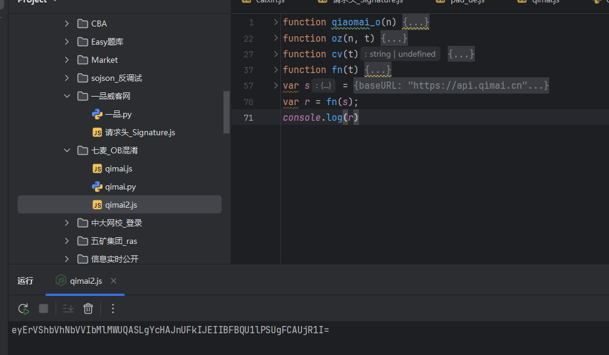
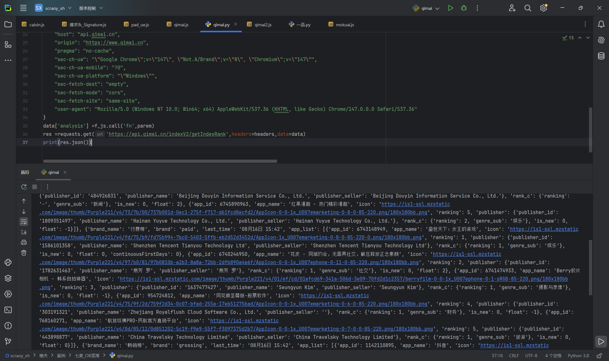

# 七麦数据 - OB混淆代码逆向

## 项目信息

- **网站**：https://www.qimai.cn/
- **难度**：⭐⭐⭐⭐⭐（高级）
- **技术**：OB混淆逆向 + 异或加密 + 双层函数拆解
- **完成时间**：2024

---

## 技术亮点

### 🔥 OB混淆代码逆向（市场稀缺技能）

**OB混淆特点**：
- 变量名全是无意义单字母
- 随机命名，完全读不懂
- 市面上最常见的混淆方式

**调试技巧**：
- 鼠标悬浮在变量上，浏览器自动显示真实值
- 不用手动解混淆
- 大幅降低调试难度

---

## 逆向过程

### Step 1：参数搜索失败

- 全局搜索`analysis`关键词 → 无结果
- 换思路：搜索API路径`indexV2/getIndexRank`
- 找到2处相关代码

---

### Step 2：定位加密入口

**请求函数**：
```javascript
getData: function(t) {
    var a = this;
    this.loading = !0;
    var e = this.getReqestParams(t);
    this.$http.get("/indexV2/getIndexRank", {
        params: e
    }).then(...)
}
```

在`getReqestParams`打断点 → 跟栈 → 进入OB混淆代码

---

### Step 3：OB混淆代码分析

**混淆代码示例**：
```javascript
o()[Wt][Kt][Ut](function(t) {
    try {
        var n;
        f || $ != s || (n = (0, i[Zt])(m),
        s = c[x][k][Rt] = -(0, i[Zt])(l) || +new R[K] - r2 * n);
        var e, r = +new R[K] - (s || H) - 1661224081041, a = [];
        
        // 核心生成语句
        e = (0, i[Jt])((0, i[Qt])(a, d))
        
        -B == t[qt][O](v) && (t[qt] += (-B != t[qt][O](Bn) ? Nn : Bn) + v + B5 + R[V5](e)),
        t
    } catch (t) {}
}
```

**关键发现**：
- 传入时`t`没有analysis参数
- 执行完后`t`有了analysis
- 核心语句：`e = (0,i[Jt])((0,i[Qt])(a, d))`

---

### Step 4：双层函数拆解

#### 第一层：异或加密（内层）
```javascript
function h(n, t) {
    t = t || u();
    for (var e = (n = n[$5](N))[z], r = t[z], a = q5, i = H; i < e; i++)
        n[i] = o(n[i][a](H) ^ t[(i + 10) % r][a](H));
    return n[I5](N)
}
```

**逻辑**：对每个字符做异或运算

#### 第二层：转码处理（外层）
```javascript
function p(t) {
    t = R[V5](t)[T](/%([0-9A-F]{2})/g, function(n, t) {
        return o(Y5 + t)
    });
    try {
        return R[Q5](t)
    } catch (n) {
        return R[W5][K5](t)[U5](Z5)
    }
}
```

**逻辑**：URL编码 + Base64处理

---

## OB混淆调试技巧（核心价值）

### 技巧1：鼠标悬浮看变量
- 不用手动解混淆
- 浏览器自动显示真实值
- 节省大量时间

### 技巧2：单步调试观察变化
- 逐步执行，观察变量变化
- 找到关键转换点
- 记录输入输出

### 技巧3：控制台打印中间值
- 在关键位置加断点
- 控制台输出变量值
- 验证逻辑正确性



---

## 本地实现





---

## 学到的经验

### 1. OB混淆不可怕
- 看起来吓人，实际有规律
- 浏览器调试工具很强大
- 核心是找到加密入口

### 2. 搜索技巧很重要
- 参数名搜不到 → 搜API路径
- API路径搜不到 → 搜关键字符串
- 多种方法结合使用

### 3. 双层函数要逐层拆解
- 内层函数：核心加密逻辑
- 外层函数：编码转换
- 分开处理，逐个击破

### 4. OB混淆是高价值技能
- 市面上很多网站用OB
- 会逆向的人不多
- 接单价格可以翻倍

---

## 商业价值

**OB混淆逆向是市场稀缺技能！**

- 技术难度：⭐⭐⭐⭐⭐
- 市场需求：⭐⭐⭐⭐⭐
- 单价范围：¥2000-3500/单
- 竞争程度：低（会的人少）

掌握OB混淆逆向后，可以接大部分中高端项目。

---

## 相关项目

- [烯牛数据双参数加密](../烯牛数据/)
- [EasyPaper拦截器逆向](../EasyPaper题库/)
- [一品威客双重加密](../一品威客/)

---

## ⚠️ 免责声明

**本项目仅供学习交流使用，请勿用于非法用途。**

- 本案例用于技术研究和学习目的
- 请遵守目标网站的robots.txt协议和服务条款
- 请勿用于商业爬虫、数据售卖等违法行为
- 请勿对目标网站进行高频请求，避免影响正常服务
- 使用本项目代码产生的一切后果由使用者自行承担

**技术无罪，使用需谨慎。请合法合规使用爬虫技术。**
