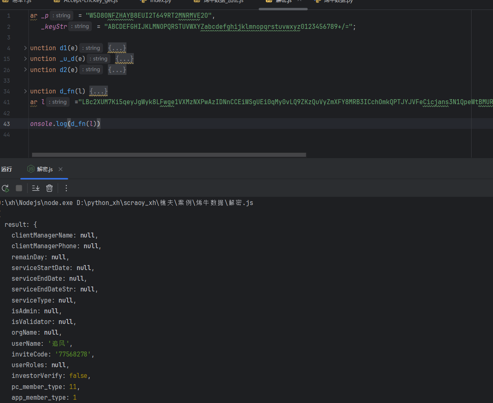
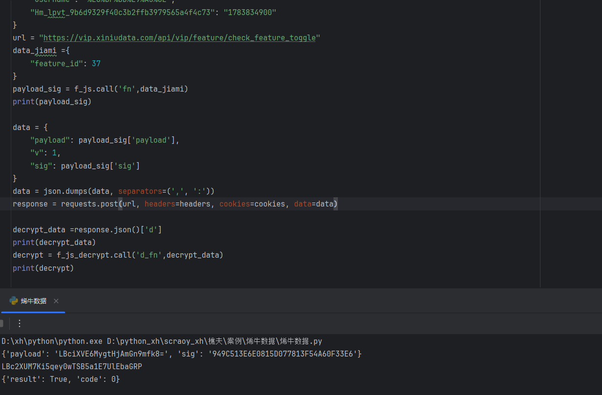
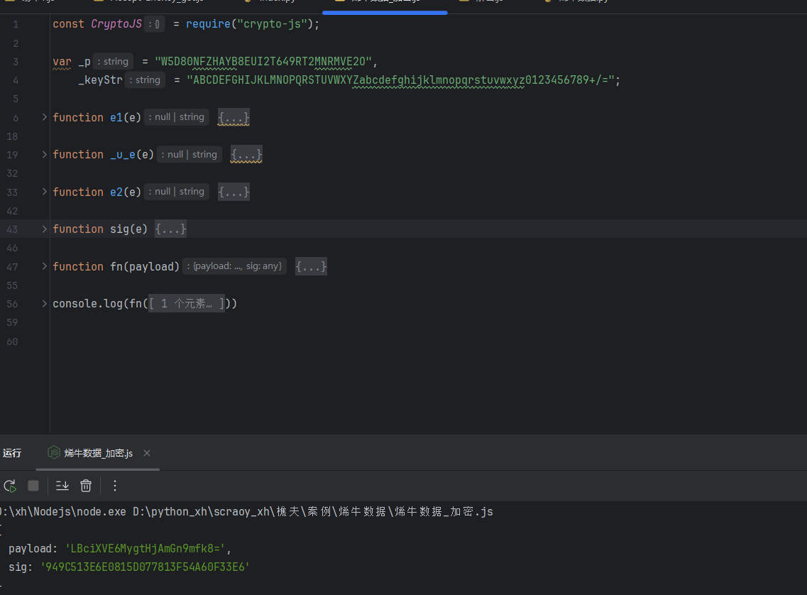

# 烯牛数据 - payload+sig双参数加密 + 响应解密

## 项目信息

- **网站**：https://vip.xiniudata.com/
- **难度**：⭐⭐⭐⭐⭐（高级）
- **技术**：异或+Base64+MD5组合 + 统一拦截器 + 双向加解密
- **完成时间**：2024

---

## 技术亮点

### 🔥 双参数加密系统

1. **payload加密**：异或 → Base64编码
2. **sig签名**：MD5(payload + 盐值)
3. **响应解密**：Base64解码 → 异或还原

### 🔥 统一拦截器封装

- 所有请求统一处理
- 加密和解密在同一个拦截器
- 需要理解整体流程，不能盲目跟栈

---

## 逆向过程

### Step 1：搜索定位

**问题**：搜索`payload`关键词 → 200+结果
**解决**：换搜API路径`feature/check_feature_toggle` → 3个结果

在第3个位置下断点 → 成功断住 → 但参数未加密 → 继续跟栈

---

### Step 2：找到拦截器

跟进到核心拦截器函数：
```javascript
value: function(t, n, o) {
    if (t.startsWith("/data-biz"))
        return ... // 特殊分支
    
    var u = JSON.stringify(n)
    var d = JSON.parse(u);
    d.v = -20180620;
    
    // 核心加密逻辑
    if (!i && x()) {
        null == r && (r = 1);
        var f = Object(s.c)(Object(s.d)(JSON.stringify(d.payload)))
        var p = Object(s.e)(f);
        d.payload = f,
        d.sig = p,
        d.v = Number(r)
    }
    
    return l()(t, y(d)).then(...)
}
```

---

### Step 3：payload加密拆解

#### 第一步：异或处理
```javascript
function e2(e) {
    if (null == (e = _u_e(e)))
        return null;
    for (var t = "", n = 0; n < e.length; n++) {
        var r = _p.charCodeAt(n % _p.length);
        t += String.fromCharCode(e.charCodeAt(n) ^ r)
    }
    return t
}
```

**关键常量**：
```javascript
var _p = "W5D80NFZHAYB8EUI2T649RT2MNRMVE2O";
```

#### 第二步：Base64编码
```javascript
function e1(e) {
    if (null == e)
        return null;
    for (var t, n, r, o, a, i, l, s = "", c = 0; c < e.length; )
        o = (t = e.charCodeAt(c++)) >> 2,
        a = (3 & t) << 4 | (n = e.charCodeAt(c++)) >> 4,
        i = (15 & n) << 2 | (r = e.charCodeAt(c++)) >> 6,
        l = 63 & r,
        isNaN(n) ? i = l = 64 : isNaN(r) && (l = 64),
        s = s + _keyStr.charAt(o) + _keyStr.charAt(a) + _keyStr.charAt(i) + _keyStr.charAt(l);
    return s
}
```

**关键常量**：
```javascript
var _keyStr = "ABCDEFGHIJKLMNOPQRSTUVWXYZabcdefghijklmnopqrstuvwxyz0123456789+/="
```

**完整流程**：
```
原始payload JSON字符串 → e2异或 → e1 Base64 → d.payload
```

---

### Step 4：sig签名生成

```javascript
function sig(e) {
    return md5(e + _p).toUpperCase()
}
```

**逻辑**：payload密文 + 盐值`_p` → MD5 → 大写

---

### Step 5：响应数据解密

在拦截器的then回调中：
```javascript
else if (1 === a) {
    var p = Object(s.a)(l)    // Base64解码
    var h = Object(s.b)(p)    // 异或还原
    var m = JSON.parse(h);
    r = m
}
```

#### Base64解码
```javascript
function d1(e) {
    var t, n, r, o, a, i, l = "", s = 0;
    for (e = e.replace(/[^A-Za-z0-9\+\/\=]/g, ""); s < e.length; )
        t = _keyStr.indexOf(e.charAt(s++)) << 2 | (o = _keyStr.indexOf(e.charAt(s++))) >> 4,
        n = (15 & o) << 4 | (a = _keyStr.indexOf(e.charAt(s++))) >> 2,
        r = (3 & a) << 6 | (i = _keyStr.indexOf(e.charAt(s++))),
        l += String.fromCharCode(t),
        64 != a && (l += String.fromCharCode(n)),
        64 != i && (l += String.fromCharCode(r));
    return l
}
```

#### 异或还原
```javascript
function d2(e) {
    for (var t = "", n = 0; n < e.length; n++) {
        var r = _p.charCodeAt(n % _p.length);
        t += String.fromCharCode(e.charCodeAt(n) ^ r)
    }
    return t = _u_d(t)
}
```

**完整流程**：
```
密文n.d → d1 Base64解码 → d2异或还原 → JSON.parse → 明文
```

---

## 核心参数

- **异或密钥**：`W5D80NFZHAYB8EUI2T649RT2MNRMVE2O`
- **Base64字符表**：标准字符表
- **签名算法**：MD5
- **签名盐值**：同异或密钥

---

## 本地实现







---

## 学到的经验（作者感悟）

> 这个是我早期练手的逆向项目，这种统一拦截器封装的代码，硬跟栈很容易绕晕。先看懂整体请求流转，找准哪里拿到服务端返回的 n，解密入口就好找很多。

### 1. 统一拦截器的特点
- 加密和解密在同一个函数
- 代码结构复杂，层层嵌套
- 不能只看局部，要理解整体流程

### 2. 不要盲目跟栈
- 容易迷失在调用链中
- 先理清请求的完整生命周期
- 定位关键节点（发送前、接收后）

### 3. 双参数加密很常见
- payload + sig是经典组合
- payload保护数据，sig防篡改
- 掌握后可以应对很多类似网站

### 4. 异或加密要注意
- 密钥循环使用（n % length）
- 加密和解密用同一个密钥
- 简单但有效

---

## 商业价值

这个案例展示了以下能力：

1. **统一拦截器逆向**：很多企业级应用都这样设计
2. **双参数加密处理**：payload + sig组合很常见
3. **完整的加解密链路**：请求加密 + 响应解密
4. **问题排查能力**：从盲目跟栈到理解整体流程

市场价值：¥1500-2500/单

---

## 相关项目

- [七麦数据OB混淆](../七麦/)
- [EasyPaper拦截器逆向](../EasyPaper题库/)
- [一品威客双重加密](../一品威客/)

---

## ⚠️ 免责声明

**本项目仅供学习交流使用，请勿用于非法用途。**

- 本案例用于技术研究和学习目的
- 请遵守目标网站的robots.txt协议和服务条款
- 请勿用于商业爬虫、数据售卖等违法行为
- 请勿对目标网站进行高频请求，避免影响正常服务
- 使用本项目代码产生的一切后果由使用者自行承担

**技术无罪，使用需谨慎。请合法合规使用爬虫技术。**
