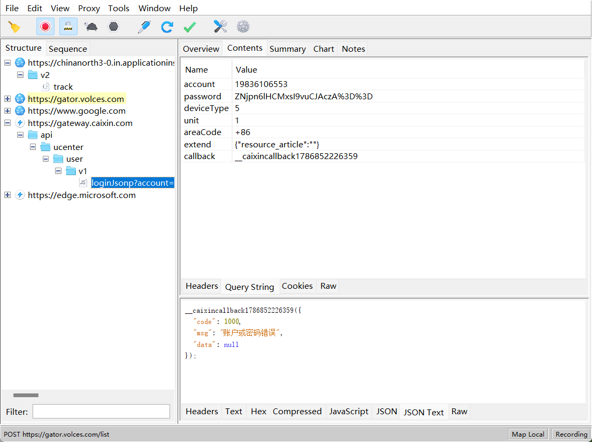

# 财新网登录密码 password 逆向分析

目标网址：[https://u.caixin.com/web/login](https://link.wtturl.cn/?target=https%3A%2F%2Fu.caixin.com%2Fweb%2Flogin&scene=im&aid=497858&lang=zh)

## 一、抓包问题与解决方案

进入财新网登录页面，本次逆向目标为登录接口中密码加密 JS 逻辑。多次点击登录按钮提交账号密码，Chrome 开发者工具 Network 面板无法捕获登录 POST 请求。 原因分析：登录请求提交后页面会立即重定向跳转，Chrome Network 面板生命周期与当前标签页绑定，页面卸载时会自动清空网络日志；即便手动开启`Preserve Log（保留日志）`，登录请求的请求载荷仍会丢失，无法获取加密后的 password 参数。

解决方案：使用 Charles 系统级代理抓包工具抓取全量流量。Charles 属于全局代理工具，独立于浏览器页面上下文，不受页面刷新、卸载机制影响。配置 SSL 证书解密 HTTPS 流量后复现登录操作，完整捕获登录接口全部报文，提取加密 password 样例、请求头、登录鉴权 Cookie 等关键数据，其中加密后的 password 值：`ZNjpn6lHCMxsI9vuCJAczA%3D%3D`。



## 二、加密入口定位流程

1. 初步检索：在 JS 文件全局关键词搜索`password:`，匹配结果较少，无法直接定位加密逻辑；
2. 断点调试：对登录提交相关代码批量下断点，重新触发登录提交流程，程序成功拦截至参数组装核心代码段：

```
callback: function() {
    var e = this
      , t = this.otherQuery
      , i = t.source
      , a = t.url
      , s = t.resource_article
      , o = {
        account: this.form.mobile,
        password: this.encode(this.encrypt(this.form.password)),
        deviceType: this.deviceType,
        unit: this.unit,
        areaCode: this.encode(this.form.areaCode),
        extend: this.encode(JSON.stringify({
            resource_article: null != s ? s : ""
        }))
    };
}
```

1. 链路梳理：password 参数生成链路为 `明文密码 → encrypt加密函数 → encode编码函数`，确定加密核心逻辑在`encrypt`方法内。

## 三、加密算法拆解

跟进`encrypt`对应的实现函数，提取完整加密逻辑：

```
u = function(t) {
    // AES固定密钥
    var e = r.a.enc.Utf8.parse("G3JH98Y8MY9GWKWG")
      , n = r.a.enc.Utf8.parse(t)
      , a = r.a.AES.encrypt(n, e, {
        mode: r.a.mode.ECB,
        padding: r.a.pad.Pkcs7
    });
    // 对AES密文字符串执行标准encodeURIComponent编码
    return encodeURIComponent(a.toString())
}
```

### 加密关键参数总结

1. 加密算法：AES-ECB

2. 密钥：`G3JH98Y8MY9GWKWG`

3. 填充方式：Pkcs7 填充

4. 后置处理：使用

   符合 ECMAScript 标准

   的 encodeURIComponent 编码密文字符串

   - 标准约束：空格编码为 %20、`/&=+@`等特殊符号百分号编码，`-_.!~*'()`不编码，中文采用 UTF-8 编码，若环境该方法实现不标准会导致最终密文不匹配。

## 四、本地复现验证

根据提取的 AES ECB 加密逻辑 + 后置 URL 编码，在本地 JS/Python 环境复现加密流程，输出密文与 Charles 抓包得到的`ZNjpn6lHCMxsI9vuCJAczA%3D%3D`完全一致，加密逻辑还原成功。

## 五、结论

财新网登录 password 逆向完成，明文密码处理流程： 明文 → UTF8 编码 → AES-ECB (Pkcs7) 加密 → 标准 encodeURIComponent 编码 → 接口提交 password 参数